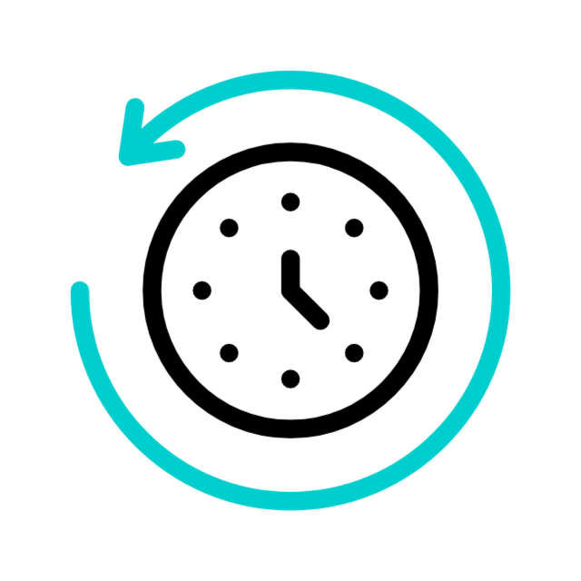

# 💧 Drink Water Reminder

A personal wellness assistant to help you stay hydrated and motivated throughout the workday!

  
_A simple Python app with voice reminders, motivational quotes, and daily water intake tracking._

---

## 🧠 Features

- ⏰ **Scheduled Notifications** – Reminds you to drink water at regular intervals.
- 🗣️ **Voice Assistance** – Uses text-to-speech to keep you engaged with inspirational quotes.
- 📅 **Time-Aware Greetings** – Automatically greets you based on time of day (morning, break, lunch, tea).
- 📝 **Daily Intake Log** – Records how much water you drink and saves it to a log file.
- 📂 **Custom Quotes** – Reads motivational lines from your personal `inspirationalv2.txt` file.

---

## 🛠 Tech Stack

| Module     | Purpose                                |
|------------|----------------------------------------|
| `pyttsx3`  | Text-to-speech for voice reminders     |
| `notifypy` | System-level notifications             |
| `schedule` | Task scheduling at fixed time slots    |
| `time`     | Current time evaluation                |
| `random`   | Shuffling and selecting unique quotes  |

---

## ⚙️ How It Works

- When you run the app, it:
  - Greets you based on current time.
  - Every 45 minutes, sends a notification and speaks a motivational quote.
  - Prompts you to input how much water you drank.
- At 6 PM, it summarizes your total intake and logs it.

---

✨ Future Ideas
- GUI interface with Tkinter or PyQt
- Export data as charts or CSV
- Set custom reminder intervals

-------------------------------------------------------------------------------------------------------------------------------------------------------------------------------------------------------------------------------------------------------------------------------
<h1 align="center">Hi 👋, I'm Amit Gehlot</h1>
<h3 align="center">Senior Quality Analyst</h3>

  

- 🌱 I’m currently learning **Python**

- 📫 How to reach me **amit.gehlot2812@gmail.com**

<h3 align="left">Connect with me:</h3>

<h3 align="left">Languages and Tools:</h3>

    

&nbsp;

